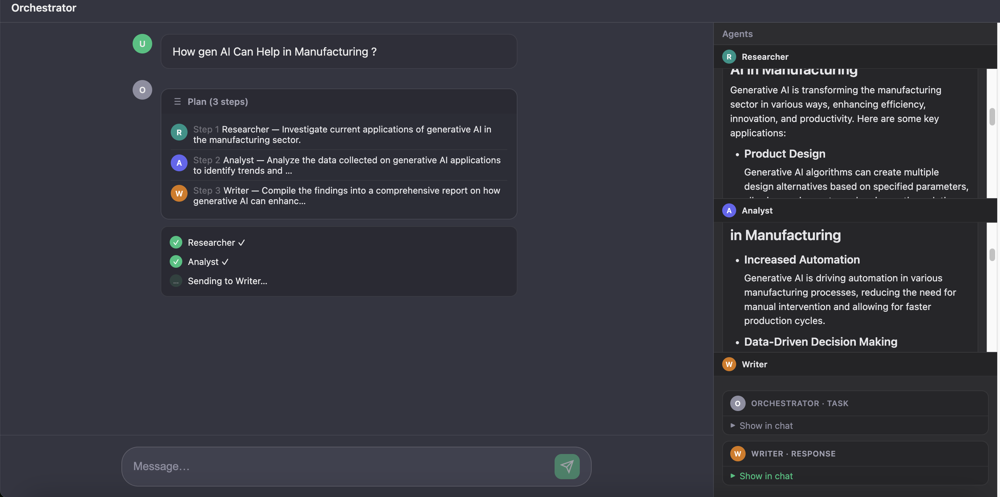
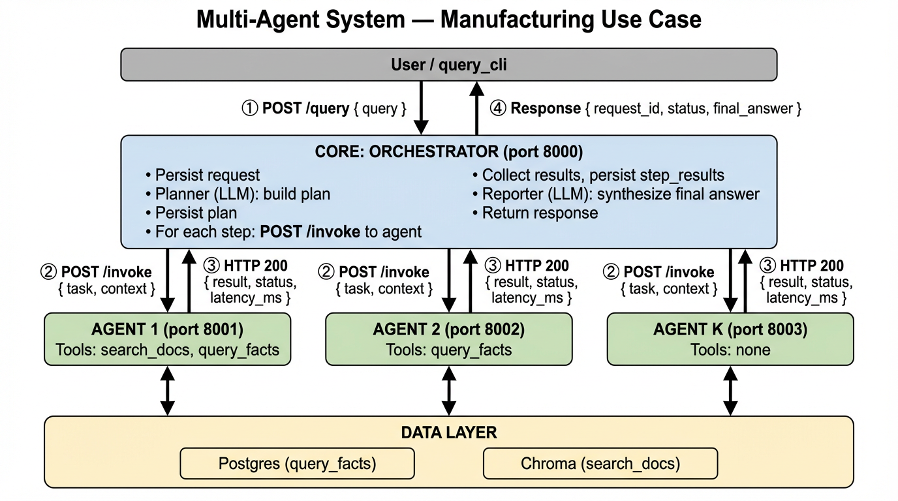

# Multi-Agent LangChain

A **lightweight Python package** for a config-driven multi-agent network: one **Orchestrator** plans and calls specialist **Agents**; you run two commands—**start** the network and **query** it.

---

## Two commands

| Command | What it does |
|--------|----------------|
| **`python scripts/startup.py`** | Starts the orchestrator + all agents (ports from config). Logs query, plan, and each agent call in the terminal. Prints the **Orchestrator UI** URL (e.g. http://127.0.0.1:8000/)—open it in a browser to use the chat interface with live plan and agent iframes. |
| **`python scripts/query_cli.py "Your question"`** | Sends a sync query, prints step-by-step agent iteration and final answer. Use `--trace` to see URLs and request/response bodies. |

One-time setup: copy `config/env/.env.example` to `config/env/.env` (or `.env` at project root), set `SQLITE_APP_PATH` and `OPENAI_API_KEY`, then run **`python scripts/migrate.py`** once to create the app SQLite DB.

---

## Quick start

```bash
# 1. Install
cd multi-agent-langchain
python3 -m venv venv && source venv/bin/activate
pip install -e .

# 2. Config
cp config/env/.env.example config/env/.env   # or copy to .env at project root
# Set SQLITE_APP_PATH, OPENAI_API_KEY (and optionally CHROMA_PATH, SQLITE_* for tools)

# 3. DB (once)
PYTHONPATH=. python scripts/migrate.py   # creates app SQLite DB at SQLITE_APP_PATH

# 4. Run
# Terminal 1 – start network
PYTHONPATH=. python scripts/startup.py

# Terminal 2 – send a query
PYTHONPATH=. python scripts/query_cli.py "What are the safety guidelines for product X?"
```

You’ll see the query, plan, each `→ agent` / `← agent` line, and the final answer in the CLI and in the startup terminal logs.

**Orchestrator Web UI:** After running `startup.py`, open the URL printed at the end (e.g. `http://127.0.0.1:8000/`) in your browser. You get a chat interface that sends queries via `POST /query/async`, shows the plan and live step progress (Researcher → Analyst → Writer), and displays each agent’s output in iframes. When the run finishes, the final reporter answer is shown in the chat.

---

## What’s in the box

- **Orchestrator** (FastAPI): receives a query → plans steps (LLM) → calls agents over HTTP → persists requests/plans/step_results in SQLite → synthesizes final answer. Serves a **web UI** at `GET /` (chat + agent iframes) and supports **sync** (`POST /query`) and **async** (`POST /query/async` + poll `GET /request/{request_id}`) flows.
- **Agents** (FastAPI, one process per agent): LangChain agents with system prompt, guardrails, and tools (e.g. `query_facts`, `search_docs`). Each agent exposes `POST /invoke`, `GET /` (simple task/result UI), and `GET /last`. Ports and config come from a domain JSON file.
- **Config**: one JSON per domain (orchestrator + agents + data_sources) and one `.env`. No code changes for new use cases—edit config only.

---

## UI



---

## Architecture (message flow)

Detailed flow of how a query becomes a final answer. Arrows show direction and content of each call.




**Summary**

| Step | From → To | Message |
|------|-----------|---------|
| ① | User/CLI → Orchestrator | `POST /query` with `{ query }` |
| ② | Orchestrator → Agent (per step) | `POST /invoke` with `{ task, context }` (context = original query + prior step results) |
| ③ | Agent → Orchestrator | HTTP 200 with `{ result, status, latency_ms }` |
| ④ | Orchestrator → User/CLI | Response with `{ request_id, status, final_answer }` |

Agents run in separate processes (one per port). The orchestrator calls them over HTTP in the order of the plan; each agent may use its tools (SQLite, Chroma) before returning. The orchestrator then synthesizes the final answer from all step results and returns it to the client.

---

## Project layout

```
multi-agent-langchain/
├── config/
│   ├── domains/             # Domain JSON (e.g. manufacturing.json)
│   └── env/                 # .env and .env.example (secrets)
├── data/                    # Optional data (e.g. chat state, chroma)
├── migrations/versions/     # SQL: app.requests, app.plans, app.step_results
├── src/
│   ├── core/                # Config loader, contracts, exceptions
│   ├── data_access/         # SQLite + Chroma clients (app_db/, vector/)
│   ├── tools/               # query_facts, search_docs (rel_db/, vector/)
│   ├── agent/               # Agent FastAPI (POST /invoke, GET /, GET /last)
│   ├── orchestrator/        # Planner, executor, reporter, session; FastAPI (/, /query, /query/async, /request/{id})
│   └── gateway/             # Optional reverse proxy
├── scripts/
│   ├── startup.py           # Start orchestrator + all agents (prints UI URL)
│   ├── query_cli.py         # Send query via CLI, print steps + answer
│   ├── listen_orchestrator.py # Poll GET /trace/last and print latest request
│   └── migrate.py           # Run DB migration (once)
├── tests/                   # Unit and integration tests
├── pyproject.toml
├── requirements.txt
└── README.md
```

---

## Commands

| Command | Description |
|--------|--------------|
| `PYTHONPATH=. python scripts/migrate.py` | Run DB migration once (needs `SQLITE_APP_PATH`). |
| `PYTHONPATH=. python scripts/startup.py` | Start orchestrator + agents. Prints Orchestrator UI URL (e.g. http://127.0.0.1:8000/). Options: `--no-kill`, `--background`, `--list-ports`, `--config <path>`. |
| `PYTHONPATH=. python scripts/query_cli.py "question"` | Send query (sync); prints request_id, steps, final answer. |
| `PYTHONPATH=. python scripts/query_cli.py "question" --trace` | Same + full URL and request/response for each HTTP call. |
| `PYTHONPATH=. python scripts/listen_orchestrator.py` | Poll orchestrator `GET /trace/last` every 5s and print latest request (query, plan, step_results, final answer). Optional: `--url`, `--interval`. |

From project root; or use `pip install -e .` and omit `PYTHONPATH=.`.

---

## Configuration

- **Domain JSON** (`config/domains/<id>.json`): `domain_id`, `orchestrator` (name, port, system_prompt, guardrails, tool_names), `agents[]`, `data_sources[]`, `env_file_path`.
- **.env** (path in JSON): `SQLITE_APP_PATH` (required), `OPENAI_API_KEY` (required), `CHROMA_PATH`, `SQLITE_*` for tools.

---

## API (for integration)

**Orchestrator** (default port 8000):

| Endpoint | Method | Description |
|----------|--------|-------------|
| `/` | GET | Web UI: chat + agent iframes, plan, live step progress, final answer. |
| `/health` | GET | Health check. |
| `/query` | POST | Sync query. Body: `{ "query": "..." }` → `{ "request_id", "status", "final_answer", "error"? }`. |
| `/query/async` | POST | Async query. Body: `{ "query": "..." }` → `202` + `{ "request_id" }`. Poll `GET /request/{request_id}` for progress and `final_answer`. |
| `/request/{request_id}` | GET | Get request state: `plan`, `step_results`, `final_answer`, `status`. |
| `/trace/last` | GET | Last request trace (for `listen_orchestrator.py`). |

**Agent** (per-agent port, e.g. 8001–8003):

| Endpoint | Method | Description |
|----------|--------|-------------|
| `/` | GET | Simple UI: last task and result. |
| `/health` | GET | Health check. |
| `/last` | GET | Last invoke payload and result. |
| `/invoke` | POST | Run agent. Body: `{ "task", "context"? }` → `{ "result", "status", "latency_ms" }`. |

---

## For developers

### 1. Extending to a new use case

To support a new domain (e.g. HR, support, internal docs):

1. **Add a domain config**  
   Create `config/domains/<domain_id>.json` (e.g. `hr.json`). Copy the structure from `config/domains/manufacturing.json`:
   - `domain_id`, `domain_name`, `env_file_path`
   - `orchestrator`: `name`, `port`, `system_prompt`, `guardrails`, `tool_names` (orchestrator usually has `tool_names: []`)
   - `agents`: list of agents; each has `name`, `port`, `system_prompt`, `guardrails`, `tool_names`
   - `data_sources`: list of `{ "id", "type", "engine", "connection_id" }`; for Chroma add `"collection_name"`
   - `session_store`: `{ "type": "sqlite", "connection_id": "SQLITE_APP_PATH" }`

2. **Environment**  
   Use the same `.env` or a new one (e.g. `config/env/hr.env`) and set `env_file_path` in the JSON. Ensure `SQLITE_APP_PATH`, `OPENAI_API_KEY`, and any `connection_id` env vars used in `data_sources` are set.

3. **Run with that domain**  
   ```bash
   PYTHONPATH=. python scripts/startup.py --config config/domains/hr.json
   PYTHONPATH=. python scripts/query_cli.py "Your HR question"
   ```

No changes to orchestrator or agent **code**—only new config. If you need a new capability (e.g. call an external API, read from another DB), add a **new tool** (see below) and reference it in the right agents’ `tool_names`.

---

### 2. Defining new tools

Tools are LangChain tools that agents can call. The registry in `src/tools/registry.py` maps `tool_names` from config to actual tool instances, injecting data clients where needed.

**Step 1 – Implement the tool**

- Add a module under `src/tools/` (e.g. `src/tools/rel_db/query.py` or a new subpackage).
- Create a **factory function** that returns a LangChain tool (use `@tool` from `langchain_core.tools`). The factory can take a client (DB URL, retriever, etc.) so the registry can inject it.

Example (conceptually like `query_facts`):

```python
# src/tools/my_tool/thing.py
from langchain_core.tools import tool

def create_my_tool(some_client):  # client comes from build_clients()
    @tool
    def my_tool(arg: str) -> str:
        """Description for the LLM: what this tool does and when to use it."""
        # use some_client, return a string
        return "result"
    return my_tool
```

**Step 2 – Register the tool**

- In `src/tools/registry.py`, in `get_tools(tool_names, clients)`:
  - For each `name` in `tool_names`, if `name == "my_tool"`, get the right client from `clients` (keyed by `data_sources[].id`), call your factory, and append the result to `result`.

Example:

```python
elif name == "my_tool":
    client = clients.get("my_data_source_id")  # id from config data_sources
    if client is None:
        continue
    result.append(create_my_tool(client))
```

**Step 3 – Wire config**

- In your domain JSON, ensure the tool’s **data source** exists under `data_sources` (so `build_clients` fills `clients["my_data_source_id"]`).
- Add `"my_tool"` to the `tool_names` list of any agent that should use it.

Agents receive only the tools listed in their `tool_names`; the orchestrator does not run tools itself.

---

### 3. Adapting to a specific use case

To tailor the package to a concrete use case (e.g. “HR policy answers”, “support ticket summarization”):

1. **Define the roles**  
   Decide which agents you need (e.g. “researcher”, “analyst”, “writer”) and what each is responsible for. One agent per role is a good default.

2. **Define data sources**  
   In `data_sources`, list every DB or vector store the agents need:
   - **SQLite**: `{ "id": "hr_db", "type": "rel_db", "engine": "sqlite", "connection_id": "SQLITE_HR_PATH" }`
   - **Chroma**: `{ "id": "docs", "type": "vector_db", "engine": "chroma", "connection_id": "CHROMA_PATH", "collection_name": "hr_policies" }`  
   Set the corresponding env vars in `.env`.

3. **Assign tools per agent**  
   In each agent’s `tool_names`, list only the tools that role should use (e.g. researcher: `["search_docs", "query_facts"]`; writer: `[]`). Use the same tool names you register in `src/tools/registry.py`.

4. **Write prompts and guardrails**  
   - **Orchestrator** `system_prompt`: instruct it to understand the query, plan steps, delegate to the right agents by name, and synthesize a final answer. Mention the list of agent names.  
   - **Each agent** `system_prompt`: role, responsibility, and “use only the provided tools”.  
   - **Guardrails**: short list of rules (e.g. “Do not fabricate data.”, “Max 500 words.”). These are passed to the agent runtime; keep them enforceable and clear.

5. **Optional: new tools**  
   If the use case needs a new capability (e.g. call an API, read from another system), add the tool in `src/tools/` and register it as in **Defining new tools** above, then add it to the right agents’ `tool_names`.

6. **Test**  
   Run `startup.py` with your domain config and send representative queries via `query_cli.py`. Use `--trace` to inspect requests and responses. Adjust prompts, guardrails, or tool assignments until behavior matches the use case.

---

## Tech used

| Area | Technology |
|------|------------|
| **Language** | Python 3.11+ |
| **API / services** | FastAPI, Uvicorn |
| **Agents / LLM** | LangChain, LangChain-OpenAI, LangChain-Classic (tool-calling agent, AgentExecutor) |
| **App database** | SQLite (aiosqlite) |
| **Vector store** | Chroma (LangChain-Chroma) |
| **Config** | JSON (domain files), python-dotenv (.env) |
| **CLI / scripts** | Python (startup, query_cli, listen_orchestrator, migrate) |

---

## License

MIT.
